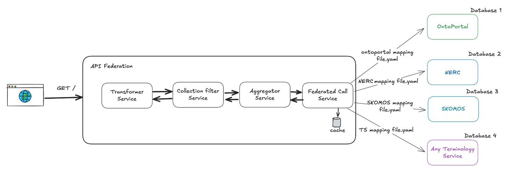

# EarthPortal API Federated Service
> This service is a fork of the **[TS4NFDI api-gateway](https://github.com/ts4nfdi/api-gateway)**
developed by the TS4NFDI consortium. The federation engine, configuration model, and core
architecture are based on their work. EarthPortal adapts and extends it for the needs of the
Data Terra ecosystem.

## Overview

The **EarthPortal API Federated Service** is the federation layer of the EarthPortal
terminology platform. It performs federated calls across multiple terminology sources both **OntoPortal sources** (such as EarthPortal, BiodivPortal, AgroPortal) and **non-OntoPortal** services (e.g. NERC, OLS, or any other terminology backend
described via a mapping file) and aggregates their results into a unified response.

It is designed to give Earth & environmental science communities a single entry point to discover, search, and consume vocabularies hosted across heterogeneous terminology
infrastructures, while keeping each source independent.

The service is **dynamic by design**: backends, mappings, and response formats are
driven by JSON/YAML configuration files, which makes it straightforward to extend the
federation to new sources OntoPortal or otherwise without touching the code.

## Features

- **Federated Search Across Multiple Terminology Services:** Seamlessly query multiple TS simultaneously and aggregate results into a unified format.
- **Deduplication across portals**: when the same artefact or concept is hosted by several OntoPortals, results are deduplicated so users see one consolidated entry.
- **Configurable filtering**: refine queries by language, domain/category, and other portal-side filters. 
- **Multiple response formats**: get results as plain JSON or JSON-LD, suitable for both web clients and semantic-web tooling.
- **Dynamic Configuration:** Utilize a JSON file to configure TS connections and response mappings, enabling easy addition or modification of terminology sources.
- **Schema Transformation:** Convert search responses into specific TS output formats, facilitating integration with existing systems.

## Installation

To set up the API-Federation, follow these steps:

1. Clone the repository to your local machine:
   `git clone https://github.com/EarthPortal/api-federation.git`
2. In your command line navigate to the project directory:
   `cd api-federation`
3. Run docker-compose to start the API Federation and its dependencies:
   `docker compose --profile all up --build`
   The service will be accessible at `http://localhost:8080/api-gateway` by default.

## Extensibility and Customization — adding a new OntoPortal backend

The service's dynamic configuration approach allows for straightforward extensibility. Adding a new TS or modifying an existing one involves updating the JSON configuration file with the relevant details and mappings. This flexibility ensures that the service can adapt to evolving data sources and requirements without the need for significant code changes.

#### Steps to Integrate a New TS Schema:

1. **Add a new Mapping Configuration file:** Create a new YAML file in the `src/main/resources/backend_types` directory. This file should define the mapping between the new TS schema and the API Federation schema. See the existing mapping files for examples of how to structure this file.
2. **Add your database URL:** edit the `src/main/resources/databases.json` file to add the new TS database URL. This file contains the connection details for all the TS databases that the API Federation will connect to.

No code changes are needed; the federation engine picks up the new backend on restart.

### CI/CD Pipeline

Both the `dev` and `main` branches are built as part of the CI process:

1. **Feature Development**
   - Create a new feature branch from `dev`.
   - Implement and test changes locally.
   - Merge into `dev` when ready.

2. **QA Deployment**
   - Commits to `dev` automatically trigger a build and deployment to the QA cluster.
   - This allows feature testing without requiring a local gateway instance.

3. **Production Deployment**
   - Once QA testing is complete, `dev` is merged into `main`.
   - The production deployment can then be **triggered manually** from the CI/CD pipeline.

